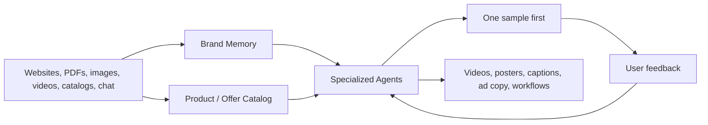
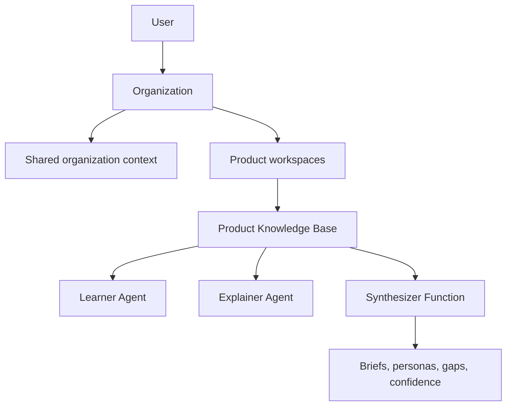

<div align="center">
  

  # Kaizen

  **The context layer and agent workspace for modern organizations.**

  Kaizen turns scattered business knowledge into living organizational memory, then gives specialized AI agents the context they need to do useful, brand-consistent work.
</div>

---

## What We Are Building

AI products are only as good as the context they receive.

Most organizations already have valuable context, but it is fragmented across websites, PDFs, product catalogs, images, videos, old campaigns, documents, conversations, and the minds of their team. Generic AI tools do not understand what the company stands for, what it sells, who it serves, how it speaks, or what it should never say.

Kaizen is being built to solve that problem.

A company should be able to give Kaizen what it already has. Kaizen will understand that information, organize it into structured memory, and let specialized agents use that memory to create outputs, answer questions, automate workflows, and improve from feedback over time.

## The First Product: Kaizen Marketing Agent

Our first commercial wedge is an AI creative production workflow for D2C, ecommerce, and visual SME brands.

A brand can provide its website, product catalog, logo, product photos, existing ads, PDFs, reels, or simple chat answers. Kaizen learns the brand and product line, creates one sample creative, takes feedback, and then generates the requested batch of brand-consistent marketing assets.

The target output is more than a video or image:

- Marketing videos and reels
- Posters and campaign images
- Ad concepts, hooks, and scripts
- Captions and calls to action
- Meta-ready primary text and headlines
- Product-specific and offer-specific campaign packages

The long-term product is broader than marketing. The same context foundation can later power catalog creation, onboarding, GTM, sales enablement, support, product education, and other organization-led agents.

## How Kaizen Works



### 1. Bring Existing Context

Kaizen should accept the way businesses already store information rather than forcing them to write a perfect prompt.

Planned multimodal inputs include:

- Websites and product pages
- PDFs, documents, decks, and catalogs
- Product photos, brand assets, and campaign images
- Videos, reels, demos, and previous ads
- Text files, notes, and conversational answers

### 2. Build Living Memory

Kaizen converts raw inputs into structured, reviewable context.

**Brand Memory** captures the brand's positioning, audience, voice, visual identity, proof points, constraints, preferences, and approved examples.

**Product / Offer Catalog** captures what the brand sells: products, services, bundles, collections, offers, benefits, objections, differentiators, and creative angles.

### 3. Deploy Context-Aware Agents

Agents use the organization's memory instead of starting from a blank prompt.

The first agent is **Mac**, the Kaizen Marketing Agent. Mac is designed to create a strong sample first, learn from feedback, and only then scale production.

## Current Project Status

Kaizen is actively being prepared for public deployment.

The current implementation is a strong product knowledge foundation that is evolving into the broader Brand Memory and agent workspace described above.

### Available Today

- Google OAuth and user-scoped conversations
- Organization and product workspaces
- Product Knowledge Base ingestion from documents and URLs
- Source-aware structured fact extraction
- Learner agent for building knowledge conversationally
- Explainer agent for answering from captured knowledge
- Deterministic knowledge confidence scoring
- Gap detection and guided gap filling
- Personas, product briefs, and suggested questions
- Supabase-backed PostgreSQL and file storage
- Review inbox and knowledge governance foundations

### In Progress / Next

- Brand-first workspace model
- Guided brand intake
- Rich Product / Offer Catalog extraction
- Multimodal image, PDF, video, and creative-example processing
- Marketing campaign briefs and sample-first feedback workflow
- Higgsfield-powered video generation
- Poster, caption, and Meta-ready copy generation
- Meta Ads Manager publishing and scheduling

## Core Product Concepts

| Concept | Purpose |
| --- | --- |
| **Organization** | The top-level workspace for a company, its context, teams, agents, and workflows. |
| **Brand Memory** | The structured memory of what a brand is, how it speaks, who it serves, what it looks like, and what it should avoid. |
| **Product / Offer Catalog** | The structured set of products, services, bundles, collections, offers, and campaign angles the brand can promote. |
| **Campaign Workspace** | The place where a user selects what to promote, for whom, in which format, and with which constraints. |
| **Creative Brief** | The structured generation input: objective, audience, product, platform, aspect ratio, duration, CTA, claims, and references. |
| **Creative Asset** | A generated video, poster, image, caption, script, or Meta ad copy package with feedback and approval history. |

## Current Architecture

The current application is built around organizations, products, knowledge bases, and specialized knowledge agents.



### Agent Architecture

| Module | Role |
| --- | --- |
| `product-interviewer.ts` | Learner Agent: conversationally builds the knowledge base. |
| `product-explainer.ts` | Explainer Agent: answers questions from captured knowledge. |
| `information-extractor.ts` | Extracts structured facts from documents and URLs. |
| `synthesizer-function.ts` | Produces briefs, personas, gaps, confidence, and suggested questions after knowledge changes. |
| `base-agent.ts` | Shared LLM, context, history, and parsing utilities. |

### Technology Stack

- **Frontend:** React 18, Vite, Wouter, TanStack Query, Tailwind CSS, shadcn/ui
- **Backend:** Node.js, Express 5, TypeScript
- **Database:** PostgreSQL with Drizzle ORM
- **Storage:** Supabase Storage
- **AI:** OpenAI

## Knowledge Ingestion

The ingestion system is designed around a simple principle: never treat ingestion as "upload a file and summarize it."

The target pipeline stores the original source, creates modality-specific derivatives, extracts evidence-backed observations, merges them into structured memory, and lets users review important inferred facts.

```text
Input
  -> Store original asset
  -> Generate derivatives
  -> Extract observations with evidence
  -> Merge into Brand Memory and Product / Offer Catalog
  -> Review important facts
  -> Use approved context in agents and workflows
```

For the detailed modality-by-modality plan, see [ingestion.md](./ingestion.md).

## Getting Started

### Prerequisites

- Node.js 20+
- PostgreSQL
- A Supabase project for storage
- An OpenAI API key
- Google OAuth credentials

### Install

```bash
git clone https://github.com/spartaaaa4/kaizen.git
cd kaizen
npm install
```

### Environment Variables

Create a `.env` file in the project root and configure the environment variables required by the server:

```bash
OPENAI_API_KEY=
DATABASE_URL=
PORT=5000

GOOGLE_CLIENT_ID=
GOOGLE_CLIENT_SECRET=
SESSION_SECRET=
APP_URL=

SUPABASE_URL=
SUPABASE_SERVICE_KEY=
```

### Run Locally

```bash
npm run dev
```

The development server runs on port `5000` by default.

### Useful Commands

```bash
npm run dev       # Start the development server with hot reload
npm run build     # Build the production application
npm start         # Run the production build
npm run check     # Run TypeScript type checking
npm run db:push   # Push the Drizzle schema to PostgreSQL
```

## Repository Structure

```text
client/src/          React frontend
server/              Express backend, routes, agents, and services
shared/              Shared schemas and isomorphic types
docs/prd/            Product requirement documents
graphify-out/        Generated knowledge graph of the repository
ingestion.md         Multimodal ingestion architecture
```

## Product Roadmap

### Phase 1: Knowledge Foundation

- Organization and product workspaces
- Document and URL ingestion
- Learner and Explainer agents
- Knowledge confidence, gaps, personas, and governance

### Phase 2: Brand Memory

- Brand-first onboarding
- Guided intake
- Product / Offer Catalog
- Reviewable brand, audience, visual, and creative context

### Phase 3: Marketing Agent

- Campaign workspace and creative briefs
- One sample first
- Feedback-driven creative preferences
- Videos, posters, scripts, captions, and Meta-ready copy

### Phase 4: Multimodal And Distribution

- Image, PDF, video, and creative-example understanding
- Higgsfield generation workflows
- Meta Ads Manager publishing, scheduling, and performance learning

### Beyond Marketing

- Catalog creation and product visualization
- Employee onboarding agents
- GTM and sales enablement agents
- Support and product education agents
- A broader context operating system for organizations

## Project Documentation

- [Marketing Agent MVP PRD](./docs/prd/2026-05-31-kaizen-marketing-agent-mvp.md)
- [Multimodal Ingestion Architecture](./ingestion.md)
- [Repository Knowledge Graph Report](./graphify-out/GRAPH_REPORT.md)
- [Agent and repository guidance](./AGENTS.md)

## Contributing

Kaizen is currently under active development. The most valuable contributions are those that strengthen context quality, source traceability, multimodal ingestion, agent reliability, and the path from organizational knowledge to useful workflows.

Before making changes:

1. Read the product PRD and relevant architecture documents.
2. Follow the existing patterns in the codebase.
3. Keep facts source-aware and reviewable.
4. Preserve the distinction between confirmed, inferred, disputed, and sensitive information.
5. Run `npm run check` and `npm run build` before publishing code changes.

## The Direction

Kaizen starts with a practical promise:

> Give us what you already have. We will learn your brand, create one strong sample, improve from your feedback, and help you produce the marketing assets you need.

The deeper ambition is to give every organization a context layer that makes all of its AI agents more useful.
