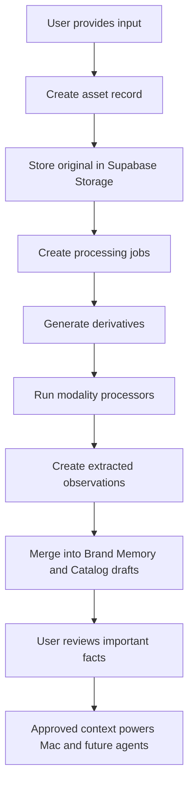

# Kaizen Ingestion Architecture

Last updated: 2026-05-31

This document captures the current ingestion strategy for Kaizen: how brands will provide context, how we should process different input types, what tools should be used, where API credits are required, and how the extracted information should become usable Brand Memory, Product/Offer Catalog, and creative campaign inputs.

## 1. Product Context

Kaizen's core belief is that AI output quality is bounded by context quality. The product should let a D2C/e-commerce brand or SME provide whatever context they already have, including websites, PDFs, images, videos, text files, brand assets, campaign examples, and conversational answers.

The system should turn those raw inputs into structured, reviewable knowledge:

- Brand Memory: what the brand stands for, how it speaks, who it sells to, visual identity, positioning, proof, and constraints.
- Product/Offer Catalog: products, collections, variants, prices if provided, benefits, objections, bundles, offers, and campaign angles.
- Creative Memory: previous ads, posters, videos, captions, hooks, visual patterns, what the brand likes/dislikes, and feedback from sample generations.
- Campaign Inputs: brief, target audience, creative format, output count, video duration, platform, CTA, and Meta-ready copy requirements.

The first live product should focus on marketing creatives for D2C/e-commerce and SMEs, while keeping the ingestion architecture general enough for future agents such as onboarding, GTM, support, sales, and catalog creation.

## 2. Current Implementation Findings

The current project already has useful foundations:

- Upload and URL ingestion exists around product workspaces.
- `/process` runs after upload/fetch and emits SSE progress events.
- Extracted facts are written into a Product Knowledge Base through `modifyPKB()`.
- The synthesizer turns raw facts into brief, personas, gaps, confidence score, and suggested questions.
- URL text is cached in Supabase Storage so processing does not always depend on live refetching.
- Conversations and messages are in Postgres.
- PKB JSON is already moving off local disk into Supabase Storage.

What is still missing for the Kaizen end state:

- Brand-level ingestion and memory are not yet first-class enough for marketing workflows.
- Product catalog extraction is shallow compared to what D2C brands need.
- Video, image, asset, and creative-example ingestion need their own processors.
- There is no durable job pipeline for long-running multimodal processing.
- There is no explicit review/approval layer for inferred brand and product facts.
- Campaign generation is not yet connected to a structured Brand Memory and Product/Offer Catalog.

## 3. Target Ingestion Principle

Never treat ingestion as "upload file, summarize file."

Instead, ingestion should be a durable pipeline:

```
Input
  -> Store original asset
  -> Create processing job
  -> Generate modality-specific derivatives
  -> Extract observations with source evidence
  -> Merge observations into structured memory
  -> Mark facts as confirmed, inferred, disputed, stale, or needs_review
  -> Let the user review important facts
  -> Use approved or clearly labeled inferred context for creative generation
```

Every extracted fact should preserve:

- source asset id
- source type
- source location, such as page number, URL, timestamp, frame number, or text span
- evidence quote or visual description
- confidence
- lifecycle status
- whether it is approved for generation

## 4. Core Data Model To Add

The exact schema can evolve, but these concepts should exist.

### `assets`

Stores every raw input the brand provides.

Important fields:

- `id`
- `org_id`
- `brand_id` or `product_id`
- `uploaded_by`
- `asset_type`: `pdf`, `image`, `video`, `text`, `url`, `website_snapshot`, `audio`, `brand_asset`, `campaign_example`
- `storage_bucket`
- `storage_path`
- `original_filename`
- `mime_type`
- `size_bytes`
- `source_url`
- `status`: `uploaded`, `processing`, `processed`, `failed`, `needs_review`
- `created_at`

### `asset_processing_jobs`

Tracks durable processing work.

Important fields:

- `id`
- `asset_id`
- `job_type`: `probe`, `transcribe`, `ocr`, `vision`, `extract_facts`, `merge_memory`
- `status`: `queued`, `running`, `succeeded`, `failed`, `skipped`
- `progress`
- `error_message`
- `started_at`
- `finished_at`

### `asset_derivatives`

Stores generated intermediates.

Examples:

- extracted text from PDFs
- OCR text from images
- audio extracted from video
- transcript JSON
- sampled video frames
- scene thumbnails
- website markdown
- structured page screenshots

Important fields:

- `id`
- `asset_id`
- `derivative_type`
- `storage_path`
- `metadata`
- `created_at`

### `extracted_observations`

Raw observations before they are merged into Brand Memory or Product Catalog.

Examples:

- "Brand uses a warm, witty, founder-led tone."
- "Hero product appears to be a plant-based protein powder."
- "Video ad uses fast cuts, creator testimonial, and before/after framing."
- "The website repeatedly emphasizes free shipping and COD."

Important fields:

- `id`
- `asset_id`
- `target_type`: `brand`, `product`, `offer`, `creative`, `audience`, `visual_identity`
- `field_path`
- `value`
- `evidence`
- `confidence`
- `lifecycle_status`
- `approved`
- `metadata`

### `brand_memory_facts`

The reviewed and merged source of truth for a brand.

Important sections:

- positioning
- voice and tone
- audience
- visual identity
- brand colors
- fonts if known
- content style
- proof points
- claims and constraints
- competitors
- preferred creative patterns
- rejected creative patterns

### `catalog_items`

Structured product and offer catalog.

Important sections:

- product name
- category
- collection
- description
- key benefits
- ingredients/materials/specs
- variants
- price
- offer/bundle
- target audience
- objections
- visual assets
- source evidence

### `creative_examples`

Stores previous ads, videos, posters, captions, and generated samples.

Important sections:

- creative type
- platform
- hook
- script
- caption
- CTA
- visual notes
- performance data if available
- user feedback
- approved/rejected status

## 5. Universal Ingestion Workflow

This should be the shared workflow for all input types.



Key rule: The original file should always be stored before any processing starts. Processing can fail and retry, but the source should not be lost.

## 6. Text File Workflow

Use for `.txt`, `.md`, pasted notes, chat answers, plain campaign briefs, and structured copy.

Workflow:

```
text input
  -> store original
  -> normalize encoding
  -> clean boilerplate
  -> chunk text
  -> extract observations
  -> merge into Brand Memory / Product Catalog / Creative Memory
  -> mark high-impact inferred facts for review
```

Recommended tools:

- Native Node file handling for upload.
- Existing ingestion service for text extraction.
- OpenAI structured extraction for brand/product/campaign facts.
- Zod schemas for strict output validation.

API credits:

- No credits for storage, cleaning, or chunking.
- LLM extraction requires API credits.

Implementation notes:

- Use larger chunks where possible, similar to the current 16,000 character extraction direction.
- Pass previously extracted field paths to later chunks to reduce duplication.
- Do not auto-approve sensitive fields such as pricing, customer names, security claims, or roadmap.

## 7. PDF Workflow

Use for product catalogs, pitch decks, brand books, menus, pricing PDFs, brochures, and campaign reports.

Workflow:

```
PDF upload
  -> store original
  -> detect whether PDF has text layer
  -> extract embedded text
  -> render selected pages as images if needed
  -> OCR scanned pages
  -> analyze important visual pages
  -> extract observations
  -> merge into Brand Memory / Product Catalog / Creative Memory
```

Recommended tools:

- `pdf-parse`, `pdftotext`, or similar for embedded text.
- Poppler or PDF.js for rendering pages to images.
- Tesseract, PaddleOCR, or EasyOCR for local OCR.
- OpenAI vision for visually important pages such as brand books, catalog layouts, ad examples, and image-heavy PDFs.

API credits:

- Text extraction does not require API credits.
- Local OCR does not require API credits.
- Vision analysis requires API credits if using OpenAI/Gemini/Claude.
- Fact extraction with an LLM requires API credits.

Implementation notes:

- Do not send every PDF page to a vision model by default.
- First extract text locally.
- Use vision only for pages that are image-heavy, contain brand visuals, product photos, layouts, or where OCR confidence is low.
- Store page-level evidence: page number, text span, OCR text, and screenshot path.

## 8. Website / URL Workflow

Use for brand websites, product pages, ecommerce stores, landing pages, blogs, and competitor references.

Workflow:

```
URL submitted
  -> fetch page
  -> store raw HTML and extracted text
  -> crawl limited internal pages
  -> screenshot key pages
  -> extract structured ecommerce data if available
  -> analyze visual identity from screenshots
  -> extract observations
  -> merge into Brand Memory and Product Catalog
```

Recommended tools:

- Existing `/fetch-url` route and Supabase text cache.
- Cheerio or Readability for HTML text extraction.
- Playwright for screenshots and pages that need JavaScript rendering.
- Sitemap discovery for limited crawling.
- JSON-LD/Product schema extraction where available.
- OpenAI structured extraction for final brand/product facts.

API credits:

- Fetching, crawling, HTML parsing, screenshots, and JSON-LD extraction do not require AI credits.
- Vision analysis of screenshots requires API credits.
- LLM extraction requires API credits.

Implementation notes:

- Set crawl limits for V1, for example home page plus up to 10 relevant internal pages.
- Prioritize pages with paths such as `/products`, `/collections`, `/shop`, `/about`, `/pricing`, `/reviews`, `/testimonials`, `/faq`, `/contact`.
- Store fetched text instead of re-fetching during `/process`.
- Handle websites that block scraping by asking the user to upload screenshots, catalogs, or product exports.

## 9. Image Workflow

Use for product photos, packaging photos, posters, Instagram posts, ad screenshots, catalog pages, brand boards, logos, and color palettes.

Workflow:

```
image upload
  -> store original
  -> extract metadata
  -> generate thumbnail
  -> OCR text
  -> detect dominant colors
  -> classify image purpose
  -> run vision analysis
  -> extract brand/product/creative observations
  -> merge into memory
```

Recommended tools:

- Sharp for resizing, thumbnails, and metadata.
- Color-thief, Vibrant, or custom sampling for dominant colors.
- Tesseract/PaddleOCR/EasyOCR for OCR.
- OpenAI vision for product, brand, and creative interpretation.

API credits:

- Metadata, resizing, thumbnails, color extraction, and local OCR do not require API credits.
- Vision analysis requires API credits.
- LLM fact extraction requires API credits.

Implementation notes:

- Separate brand assets from campaign examples.
- For logos and brand boards, extract colors, visual style, typography clues, and usage constraints.
- For product photos, extract product category, packaging claims, visible ingredients/specs, and likely catalog fields.
- For posters/ad screenshots, extract hook, offer, CTA, visual style, claims, layout, and tone.

## 10. Video Workflow

Use for reels, previous ads, founder videos, product demos, customer testimonials, unboxing videos, and raw creative references.

Target workflow:

```
video upload
  -> store original
  -> ffmpeg probe
  -> extract audio
  -> transcribe audio
  -> sample frames
  -> detect scenes
  -> OCR on frames
  -> vision analysis on selected frames
  -> merge transcript + frame insights
  -> extract campaign/brand/product facts
```

Recommended tools:

- Supabase Storage for original videos in V1.
- `ffprobe` for duration, codec, bitrate, resolution, and frame rate.
- `ffmpeg` for audio extraction, frame extraction, thumbnails, and compression.
- OpenAI transcription, Deepgram, AssemblyAI, or local Whisper for transcription.
- FFmpeg scene filter or PySceneDetect for scene detection.
- Tesseract/PaddleOCR/EasyOCR for OCR on selected frames.
- OpenAI vision for selected key frames.
- OpenAI structured extraction for campaign, brand, product, and creative facts.

API credits:

- Storage requires storage cost, not AI credits.
- `ffprobe` and `ffmpeg` do not require API credits.
- Local scene detection does not require API credits.
- Local OCR does not require API credits.
- Hosted transcription requires API credits or vendor credits.
- Local Whisper does not require API credits but needs server compute.
- Vision analysis requires API credits unless self-hosted.
- Final structured extraction usually requires LLM API credits.

Recommended V1 policy:

- Videos under 60 seconds: process automatically.
- Videos between 1 and 5 minutes: process with progress UI and frame caps.
- Videos over 5 minutes: ask the user to trim, confirm processing, or process only key segments.

Frame strategy:

- Do not send every frame to AI.
- Extract one thumbnail every 2-3 seconds for quick indexing.
- Use scene detection to find transitions.
- Select 6-12 key frames for short reels.
- Select more frames only when the video is long and the user explicitly asks for deeper analysis.

What to extract from video:

- spoken transcript
- on-screen text
- product appearances
- offer and CTA
- hook and opening pattern
- visual style
- pacing
- scene sequence
- testimonials or proof
- claims that need review
- reusable campaign insights

## 11. Audio Workflow

Use for founder voice notes, interviews, customer calls, and voiceover-only creative references.

Workflow:

```
audio upload
  -> store original
  -> probe metadata
  -> transcribe
  -> diarize if needed
  -> extract observations
  -> merge into Brand Memory / Product Catalog / Creative Memory
```

Recommended tools:

- `ffprobe` for metadata.
- `ffmpeg` for format normalization.
- OpenAI transcription or local Whisper.
- Optional diarization through Deepgram, AssemblyAI, or pyannote.

API credits:

- Metadata and conversion do not require API credits.
- Hosted transcription/diarization requires credits.
- Local transcription requires compute only.
- LLM extraction requires API credits.

Implementation notes:

- Founder voice notes are high-value for brand tone and positioning.
- Customer calls are high-value for objections, benefits, target persona language, and proof.
- Claims from audio should usually be `asserted` unless corroborated by another source.

## 12. Chat Intake Workflow

Chat should not be an empty "tell us everything" box. It should be guided.

Workflow:

```
guided question
  -> user answer
  -> save message
  -> extract facts from answer
  -> write to draft memory
  -> ask next best missing question
  -> stop when enough context exists for first sample
```

Recommended approach:

- Ask small, specific questions.
- Use the already-known Brand Memory and Catalog to avoid re-asking.
- Prefer questions that unlock a first creative sample.
- Let users skip questions.
- Track declined fields so they are not repeatedly asked.

High-value V1 questions:

- What do you sell?
- Who buys it?
- What are your top 3 products or offers?
- What makes the brand/product better or different?
- What tone should ads use?
- What claims should we avoid?
- Which product should we create the first ad for?
- What output do you want: poster, video, caption, or full Meta ad package?
- How many outputs do you want?
- For videos, what duration do you want?

## 13. Brand Memory Merge Workflow

Raw extracted observations should not directly become final brand truth.

Workflow:

```
observations
  -> normalize field paths
  -> group duplicates
  -> detect conflicts
  -> assign confidence and lifecycle status
  -> create memory draft
  -> require review for sensitive/high-impact facts
  -> write approved or inferred facts to Brand Memory
```

Merge rules:

- Multiple sources confirming the same point should increase confidence.
- Contradictions should create review items.
- Pricing, customer names, security claims, and roadmap should never be auto-approved.
- Visual identity can be inferred, but should be easy for the user to correct.
- Campaign preferences should learn from user feedback over time.

## 14. Campaign Context Workflow

Once Brand Memory and Product Catalog exist, Mac should create one sample first, not a large batch.

Workflow:

```
Brand Memory + Product Catalog
  -> user chooses product/offer
  -> user defines output type/count/duration/platform
  -> Mac creates one sample concept
  -> user gives feedback
  -> memory captures preference
  -> Mac improves direction
  -> batch generation starts
```

Required campaign inputs:

- product or offer
- target audience
- campaign goal
- platform
- format: video, poster, carousel, caption, or full ad set
- output count
- video duration when relevant
- brand constraints
- required CTA
- offer/discount if any

Mac output package:

- campaign concept
- hook options
- script
- scene plan
- image/video generation prompt
- caption
- headline
- primary text
- CTA
- Meta-ready copy variants
- asset notes for Higgsfield or image generation

## 15. Storage Recommendation

Use Supabase Storage for V1 because the project already uses Supabase and the implementation speed matters.

Recommended split:

- Supabase Storage: source uploads, private brand assets, PKB JSON, text caches, derivatives.
- Postgres: asset records, jobs, extracted observations, review states, conversations, campaign objects.
- Later: consider Cloudflare R2 for generated public videos/images if egress cost becomes important.

Storage rule:

- Store original assets permanently unless the user deletes them.
- Store derivatives with clear regeneration rules.
- Do not store large generated media only in the database.
- Use signed URLs for private assets.

## 16. Processing Queue Recommendation

Long-running ingestion should not run entirely inside request/response routes.

Recommended V1:

- Keep upload route fast.
- Store the original.
- Create asset and job rows.
- Enqueue processing.
- Frontend subscribes or polls job status.
- Workers process assets and update progress.

Good options:

- `pg-boss` if we want a Postgres-native queue.
- Inngest if we want a managed durable workflow layer.
- BullMQ if we use Redis.

For fastest V1 with current stack, `pg-boss` or a simple Postgres-backed jobs table is the most natural.

## 17. API Credit Strategy

Use code/local tools for mechanical extraction. Spend AI credits only where judgment is required.

No AI credits usually needed:

- storing files
- MIME detection
- ffprobe metadata
- ffmpeg audio/frame extraction
- PDF text extraction
- HTML parsing
- sitemap crawling
- screenshot capture
- image resizing
- thumbnail generation
- local OCR
- local Whisper transcription
- color extraction
- scene detection

AI/vendor credits likely needed:

- hosted transcription
- image/video frame understanding
- brand/style interpretation
- creative pattern interpretation
- structured fact extraction
- conflict resolution suggestions
- campaign concept generation
- script/caption/Meta copy generation

Practical rule:

- Use deterministic tools first.
- Reduce input size.
- Cache derivatives.
- Send only selected, high-signal context to AI.
- Store all outputs so retries do not repeat expensive calls.

## 18. Foolproofing Checklist

Ingestion should be resilient to failure, incomplete uploads, and noisy user data.

Must-have safeguards:

- File type and size validation.
- Virus/malware scanning before processing public uploads.
- Per-brand processing limits.
- Retryable jobs with error messages.
- Idempotent processing keyed by asset checksum.
- Progress UI for long-running jobs.
- Partial success handling.
- Source evidence for every extracted fact.
- Human review for sensitive or high-impact facts.
- Clear distinction between confirmed and inferred facts.
- Conflict queue for contradictions.
- Asset deletion and data retention controls.
- Cost caps for AI processing.
- Frame/page caps for large files.
- Timeouts on website crawling.
- Fallback path when a website blocks crawling.

## 19. V1 Implementation Plan

### Phase 1: Asset Foundation

- Add `assets`, `asset_processing_jobs`, `asset_derivatives`, and `extracted_observations`.
- Wrap current uploads and URL ingestion in asset records.
- Store originals in Supabase Storage.
- Keep current `/process` behavior but start recording jobs and observations.

### Phase 2: Brand Memory And Catalog

- Add Brand Memory and Product/Offer Catalog schemas.
- Extend extraction prompts for D2C/e-commerce and SME fields.
- Add review UI for inferred brand/product facts.
- Add guided intake instead of an empty prompt box.

### Phase 3: Image And PDF Upgrade

- Add image processor with metadata, thumbnails, OCR, colors, and vision.
- Add PDF processor with embedded text, OCR fallback, selected page vision.
- Store page/frame/image evidence.

### Phase 4: Video Processor

- Add ffprobe and ffmpeg worker.
- Extract audio and transcript.
- Sample frames and detect scenes.
- OCR selected frames.
- Vision-analyze selected key frames.
- Merge transcript and visual insights into creative observations.

### Phase 5: Mac Campaign Workflow

- Build campaign brief object.
- Generate one sample first.
- Capture user feedback.
- Improve direction.
- Batch-generate requested number of posters/videos/captions.
- Package Meta-ready copy.

## 20. Open Decisions

These should be decided before heavy implementation:

- Whether Brand Memory is stored as separate DB rows, PKB JSON, or both.
- Whether Product Catalog should replace current `products` semantics or sit under a `brand`.
- Which queue system to use.
- Whether V1 transcription uses OpenAI hosted transcription or local Whisper.
- Whether V1 OCR uses Tesseract, PaddleOCR, or a hosted OCR service.
- Whether generated media outputs stay in Supabase or move to R2 later.
- What video duration and file-size caps are acceptable for launch.
- Which facts require mandatory review before Mac can use them.

## 21. Recommended Default Stack For V1

- Supabase Storage for original assets and derivatives.
- Postgres for asset/job/observation/review/campaign state.
- Existing Drizzle ORM for schema.
- `ffmpeg` and `ffprobe` for video/audio operations.
- Tesseract or PaddleOCR for local OCR.
- Sharp for image resizing/thumbnails/color prep.
- Playwright for website screenshots where needed.
- OpenAI transcription for fastest hosted audio transcription.
- OpenAI vision for selected images/pages/frames.
- OpenAI structured outputs for extraction and campaign generation.
- Postgres-backed queue or `pg-boss` for durable jobs.

This gives Kaizen a practical path to ship fast while keeping the architecture expandable for future org-led agents.
